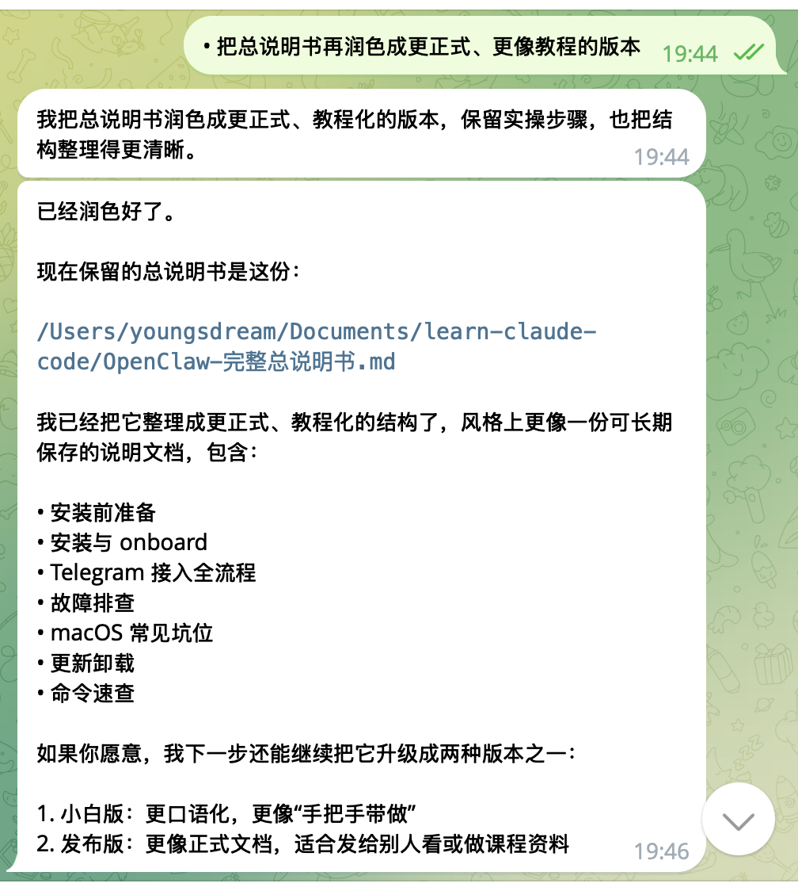

[OpenClaw新手完整学习路径-更适合新手食用的学习+使用教程](https://x.com/AI_Jasonyu/status/2026455606970954087)
[OpenClaw 新手保姆级教程：Mac 一次装好，Telegram / WhatsApp 直接开用](https://x.com/fankaishuoai/status/2020094295844470980?s=20)

skill/oepnclaw 常用命令自查表
[🐲🦞扫盲版-给不会使用的同学看](https://my.feishu.cn/wiki/THLNw1vWCiXJD6kvomlcYpu5nRe)

skill/oepnclaw 常用命令自查表

[OpenClaw 多 Agent 飞书 Bot 完整配置指南](https://my.feishu.cn/docx/Qj46dEvfvoSuZOx0vUvcWIcGnyd)

[OpenClaw 从入门到精通指南](https://my.feishu.cn/docx/P6zsdsgYco6i4XxLeIccvlpvnQe)

[OpenClaw 完全实战手册：从认识到上手，从配置到变现](https://my.feishu.cn/wiki/HPFDwzivviH2PzkP3uockjuGn8N)


以下文档由openclaw生成




# OpenClaw 安装、接入 Telegram 与 macOS 运维教程

> **文档目标**
>
> 本文是一份面向新手的完整教程，帮助你从零开始安装 OpenClaw，完成首次引导，接入 Telegram，并在 macOS 环境下稳定运行。文档同时补充了常见故障现象、排查步骤与日常运维建议，适合作为长期参考手册。

---

## 一、OpenClaw 是什么

在开始安装之前，建议先理解 OpenClaw 的几个核心组成部分：

- **openclaw CLI**：命令行工具，用于安装、配置、检查状态、发送消息、查看日志等。
- **Gateway**：后台常驻服务，负责连接消息渠道、调度模型、运行 agent。
- **Dashboard / Control UI**：浏览器中的图形界面，用于直接聊天、查看系统状态和管理配置。
- **Channels**：对外连接的消息渠道，例如 Telegram、Discord、WhatsApp 等。

可以把它理解为：

- CLI 负责“管理系统”
- Gateway 负责“持续运行”
- Dashboard 负责“可视化操作”
- Channels 负责“接收与发送外部消息”

---

## 二、安装前准备

### 2.1 系统要求

OpenClaw 支持以下运行环境：

- **macOS**
- **Linux**
- **Windows**（建议通过 **WSL2** 运行）

### 2.2 Node.js 版本要求

需要安装：

- **Node.js 22 或更高版本**

可通过以下命令检查：

```bash
node --version
```

如果你的机器尚未安装 Node，官方安装脚本通常会自动处理。

---

## 三、安装 OpenClaw

OpenClaw 提供两种主要安装方式：

### 3.1 方式一：官方安装脚本（推荐）

这是最简单、最适合新手的方式。

#### macOS / Linux / WSL2

```bash
curl -fsSL https://openclaw.ai/install.sh | bash
```

#### Windows PowerShell

```powershell
iwr -useb https://openclaw.ai/install.ps1 | iex
```

### 3.2 仅安装但跳过引导

如果你想先安装、稍后再配置：

#### macOS / Linux / WSL2

```bash
curl -fsSL https://openclaw.ai/install.sh | bash -s -- --no-onboard
```

#### Windows PowerShell

```powershell
& ([scriptblock]::Create((iwr -useb https://openclaw.ai/install.ps1))) -NoOnboard
```

### 3.3 方式二：通过 npm 或 pnpm 手动安装

适合已经熟悉 Node 生态、希望自己掌控安装流程的用户。

#### npm 安装

```bash
npm install -g openclaw@latest
openclaw onboard --install-daemon
```

如果在 macOS 上遇到 `sharp` 相关依赖问题，可尝试：

```bash
SHARP_IGNORE_GLOBAL_LIBVIPS=1 npm install -g openclaw@latest
```

#### pnpm 安装

```bash
pnpm add -g openclaw@latest
pnpm approve-builds -g
openclaw onboard --install-daemon
```

> 说明：pnpm 默认会对带 build scripts 的依赖进行额外确认，因此需要执行 `pnpm approve-builds -g`。

---

## 四、首次引导（Onboarding）

安装完成后，建议立即执行首次引导：

```bash
openclaw onboard --install-daemon
```

### 4.1 这一步的作用

该命令会帮助你完成以下配置：

- 初始化 OpenClaw 的运行配置
- 安装并注册 Gateway 后台服务
- 配置基础认证信息
- 引导接入消息渠道（可选）

### 4.2 为什么推荐 `--install-daemon`

加上 `--install-daemon` 后，Gateway 会以后台服务方式运行，优点包括：

- 关闭终端后仍可继续工作
- 适合长期运行
- 更适合作为本地常驻助手或服务器进程

---

## 五、验证 OpenClaw 是否安装成功

安装完成后，建议按以下顺序验证。

### 5.1 检查 Gateway 服务状态

```bash
openclaw gateway status
```

### 5.2 查看系统整体状态

```bash
openclaw status
```

### 5.3 打开 Dashboard

```bash
openclaw dashboard
```

如果命令能够正常打开浏览器，也可以直接访问：

```text
http://127.0.0.1:18789/
```

### 5.4 预期结果

正常情况下，你应该看到：

- Gateway 可访问（reachable）
- Gateway 服务处于运行状态
- Dashboard 页面可以正常打开

如果上述任一项失败，请先跳到本文的“故障排查”与“macOS 常见坑位”章节查看。

---

## 六、从零开始接入 Telegram

这一部分是本文最实用的内容：从创建机器人，到拿到 chat_id，再到成功发出第一条测试消息。

---

### 6.1 准备工作

请提前准备：

- 一个可正常使用的 Telegram 账号
- 已安装并能运行的 OpenClaw
- 大约 10 分钟操作时间

你会接触到两个关键概念：

- **BOT_TOKEN**：Telegram 为你的机器人生成的访问令牌
- **chat_id**：机器人向哪个会话发送消息所使用的目标 ID

---

### 6.2 通过 BotFather 创建 Telegram 机器人

1. 打开 Telegram
2. 搜索官方账号 **@BotFather**
3. 发送命令：

```text
/start
```

4. 然后发送：

```text
/newbot
```

5. 按提示依次设置：
   - **Bot Name**：机器人的显示名称
   - **Username**：机器人的唯一用户名，必须以 `bot` 结尾

例如：

- 显示名称：`BigBoss Assistant`
- 用户名：`bigboss_helper_bot`

### 6.3 你应该看到什么

BotFather 会返回一段消息，其中包含：

```text
Use this token to access the HTTP API:
```

下面紧跟着一串 token，例如：

```text
123456789:AAxxxxxxxxxxxxxxxxxxxxxxxxxxxx
```

这就是你的 **BOT_TOKEN**。

> **安全提醒**：BOT_TOKEN 等同于密码。不要发到群聊，不要截图公开，不要上传到公开仓库。

---

### 6.4 将 BOT_TOKEN 配入 OpenClaw

你可以通过两种方式完成。

#### 方法一：通过 Dashboard 配置（推荐）

1. 打开 Dashboard
2. 找到 **Channels** 或 **Telegram** 相关设置项
3. 粘贴 BOT_TOKEN
4. 保存并启用该渠道

#### 方法二：重新执行 Onboarding

如果你在首次引导时跳过了 Telegram，可以重新执行：

```bash
openclaw onboard
```

然后在渠道配置步骤中填写你的 Telegram token。

### 6.5 预期结果

完成后，再运行：

```bash
openclaw status
```

你应该能看到 Telegram 渠道显示为 **OK** 或处于已启用状态。

---

### 6.6 给机器人发送第一条消息

完成配置后，还需要在 Telegram 里主动找你的机器人说一句话。

步骤如下：

1. 搜索并打开你刚刚创建的 bot
2. 点击进入聊天
3. 发送：

```text
/start
```

4. 再发送一条普通文本，例如：

```text
hello
```

### 6.7 这一步的作用

这一步会让 Telegram 为你和机器人之间的对话建立有效会话，从而生成后续 CLI 发消息所需的 `chat_id`。

---

### 6.8 获取 chat_id

你可以采用以下两种方式。

#### 方法一：通过 `openclaw status` 查看

```bash
openclaw status
```

在输出中查看 session 信息，通常会看到类似：

```text
agent:main:telegram:direct:6150...
```

如果你是私聊场景，通常目标 ID 就是你自己的 Telegram 数字 ID。

#### 方法二：通过 Telegram 的 `getUpdates` 接口查看

在浏览器中访问：

```text
https://api.telegram.org/bot<TOKEN>/getUpdates
```

将 `<TOKEN>` 替换为你的实际 bot token。

返回的 JSON 中查找：

```json
message.chat.id
```

该字段即为 `chat_id`。

> **注意**：这种方法会把 token 暴露在浏览器历史记录中，因此只建议在自己的电脑上临时调试时使用。

---

### 6.9 从 CLI 发送一条测试消息

将 `<chat_id>` 替换为你刚获取到的会话 ID：

```bash
openclaw message send --channel telegram --target <chat_id> --message "Hello Big_boss, from OpenClaw CLI"
```

### 6.10 预期结果

如果配置正确，你会立即在 Telegram 中收到该消息。

如果没有收到，请检查：

1. Telegram 渠道是否处于 OK 状态
2. 机器人是否已经收到过你发送的 `/start` 或普通消息
3. `chat_id` 是否填写正确
4. Gateway 是否处于运行状态

---

### 6.11 进入日常使用状态

当 Telegram 渠道跑通后，你就可以把 OpenClaw 当作一个真实的聊天助理来使用。

例如：

- “帮我整理下面的内容成待办事项”
- “把这段话润色成更正式的中文”
- “帮我检查一下 OpenClaw 现在是不是正常运行”

这时，你在 Telegram 中发出的消息，实际上就会被 OpenClaw 的 agent 接收和处理。

---

## 七、常见问题与基础排查

### 7.1 运行自检

当你不确定哪里出问题时，先执行：

```bash
openclaw doctor
```

如果当前版本支持自动修复，还可以执行：

```bash
openclaw doctor --repair
```

---

### 7.2 终端提示找不到 `openclaw`

执行以下命令查看环境：

```bash
node -v
npm -v
npm prefix -g
echo "$PATH"
```

如果全局安装目录不在 PATH 中，可以先临时添加：

```bash
export PATH="$(npm prefix -g)/bin:$PATH"
```

如果想长期生效，请将这行配置写入：

- `~/.zshrc`
- 或 `~/.bashrc`

然后重新打开终端。

---

### 7.3 查看实时日志

当 Telegram 无法收发消息，或 Dashboard 无法打开时，最有价值的排查方式之一是查看日志：

```bash
openclaw logs --follow
```

通过日志，你通常可以判断是：

- token 错误
- 渠道连接失败
- Gateway 启动异常
- 端口冲突
- 权限问题

---

## 八、macOS 常见坑位专章

如果你是在 macOS 上使用 OpenClaw，下面这几类问题是最常见的。

---

### 8.1 使用 nvm 后，Node 升级或切换版本导致 `openclaw` 命令失效

#### 现象

你曾经装好过 OpenClaw，但终端突然出现：

```text
zsh: command not found: openclaw
```

#### 原因

如果你通过 `nvm` 管理 Node，那么 OpenClaw 往往会被安装在某个具体版本的 Node 目录下，例如：

```text
~/.nvm/versions/node/<version>/bin/openclaw
```

一旦你切换了 Node 版本，或 shell 没正确加载 nvm，`openclaw` 就可能不在 PATH 中。

#### 排查方法

```bash
ls -la ~/.nvm/versions/node/*/bin/openclaw
```

#### 临时解决方法

```bash
~/.nvm/versions/node/<version>/bin/openclaw status
```

#### 长期解决方法

- 确保 `~/.zshrc` 中正确初始化了 nvm
- 固定一个常用的 Node 版本
- 必要时重新安装全局包到当前版本

---

### 8.2 Gateway 后台服务（LaunchAgent）异常

#### 现象

- Dashboard 打不开
- `openclaw status` 提示服务未运行
- Telegram 无法正常响应

#### 检查方式

```bash
openclaw gateway status
```

#### 常见处理方式

```bash
openclaw gateway restart
```

如果仍未恢复，可进一步执行：

```bash
openclaw doctor --repair
```

---

### 8.3 端口被占用，导致 Dashboard 无法打开

OpenClaw 常见本地地址为：

```text
http://127.0.0.1:18789/
```

如果该页面打不开，可能是端口已被其他进程占用。

#### 检查命令

```bash
lsof -nP -iTCP:18789 -sTCP:LISTEN
```

#### 处理建议

- 找出占用该端口的进程
- 停止对应进程，或调整 OpenClaw 配置端口
- 然后执行：

```bash
openclaw gateway restart
```

---

### 8.4 权限、钥匙串（Keychain）与网络访问问题

在 macOS 上，首次运行某些服务或写入凭据时，可能会触发系统权限提示。

#### 常见现象

- 弹出钥匙串访问提示
- 弹出网络访问授权提示
- 在公司网络或代理环境下无法连接外部服务

#### 建议处理方式

- 优先在家庭网络环境测试
- 遇到凭据写入失败或认证异常时，运行：

```bash
openclaw doctor
```

---

### 8.5 通过反向代理暴露 Dashboard 时的安全问题

如果你打算用 nginx、caddy 或 traefik 将 Dashboard 暴露到局域网或公网，请务必注意：

- 仅允许可信 IP 访问
- 正确配置 `gateway.trustedProxies`
- 使用 HTTPS
- 不要直接把未保护的本地面板暴露到公网

否则，OpenClaw 的安全检查可能会提示风险告警。

---

## 九、更新与卸载

### 9.1 更新 OpenClaw

如果你是通过 npm 安装的，可以使用：

```bash
npm install -g openclaw@latest
```

更新完成后，建议再次执行：

```bash
openclaw status
openclaw gateway status
```

确认服务仍能正常工作。

### 9.2 卸载 OpenClaw

由于不同安装方式对应的卸载步骤可能不同，建议优先参考官方 uninstall 文档进行处理。

---

## 十、推荐的新手最短上手路径

如果你想用最短时间把 OpenClaw 跑起来，建议按下面顺序操作：

1. 使用官方脚本安装 OpenClaw
2. 执行 `openclaw onboard --install-daemon`
3. 运行 `openclaw gateway status` 确认服务正常
4. 打开 `openclaw dashboard`
5. 配置 Telegram bot token
6. 在 Telegram 给 bot 发送 `/start`
7. 获取 `chat_id`
8. 用 CLI 发送一条测试消息

做到这里，就已经完成了从安装到实际可用的完整闭环。

---

## 十一、附录：常用命令速查

```bash
# 查看整体状态
openclaw status

# 查看 Gateway 服务状态
openclaw gateway status

# 打开 Dashboard
openclaw dashboard

# 查看实时日志
openclaw logs --follow

# 运行自检
openclaw doctor

# 自检并尝试修复
openclaw doctor --repair

# 重启 Gateway
openclaw gateway restart

# 发送 Telegram 测试消息
openclaw message send --channel telegram --target <chat_id> --message "test"
```

---

## 十二、参考来源

本文内容整理自 OpenClaw 本机文档与当前环境信息，主要参考包括：

- OpenClaw Install 文档
- OpenClaw Getting Started 文档
- OpenClaw Channels / Telegram 文档
- OpenClaw Gateway / Configuration 文档

---

## 十三、结语

如果你是第一次接触 OpenClaw，不必一开始就把所有功能都搞懂。更实用的方式是：

1. 先安装成功
2. 再让 Dashboard 打开
3. 然后把 Telegram 跑通
4. 最后再逐步研究更深的配置与自动化

只要你完成了“能打开 Dashboard、Telegram 能收到测试消息”这两个目标，就已经跨过了最关键的门槛。
