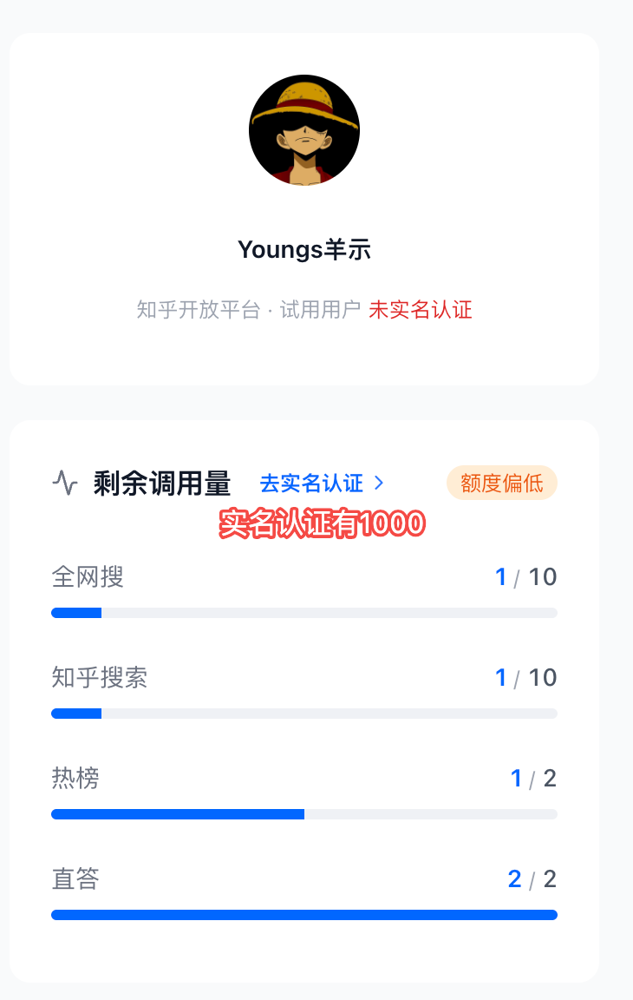

# 知乎直答 MCP 接入指南

## 概述

知乎直答 MCP 通过 MCP Streamable HTTP 协议提供知乎直答能力，适合接入支持 MCP 的 Agent、助手或工作流系统。

当前服务仅提供**工具能力**，不提供资源（resources）与提示词（prompts）能力。

## 接口信息

| 说明 | 值 |
|------|-----|
| HTTP URL | `https://developer.zhihu.com/api/mcp/zhida/v1/stream` |
| HTTP Method | POST |
| 传输方式 | MCP Streamable HTTP |
| 工具名 | `zhida` |

**说明：** 当前通过单一 `stream` 端点承载 `initialize`、`tools/list`、`tools/call` 请求。

## 鉴权

请求头：

```
Authorization: Bearer <your_access_secret>
```

> 建议每次请求均携带鉴权信息。

## 额度说明

直答每日调用额度为 **2 次**（试用用户），实名认证后可提升至 **1000 次**。



- API Token 管理：https://developer.zhihu.com/profile
- 知乎数据开发平台文档中心：https://developer.zhihu.com/docs?key=authorization

## 工具定义

### zhida

**入参：**

| 名称 | 类型 | 必填 | 说明 |
|------|------|------|------|
| query | String | 是 | 用户问题 |
| member_id | Number | 否 | 预留字段，可不传 |
| model | String | 是 | 直答模型 |

**支持的 model：**

| 模型 | 说明 |
|------|------|
| `zhida-fast-1p5` | 快速回答，日常推荐使用 |
| `zhida-thinking-1p5` | 深度思考模型 |
| `zhida-agent` | 智能检索与回答 |

**返回：**

`tools/call` 的结果作为标准 MCP CallToolResult 返回，当前返回文本内容为直答最终答案。

> MCP 层默认等待下游直答完整输出后再返回工具结果。如需消费增量事件或更丰富的思考过程，建议直接使用直答原生接口。

## 接入流程

### 1. 初始化 MCP 会话

```bash
curl -X POST 'https://developer.zhihu.com/api/mcp/zhida/v1/stream' \
  -H 'Authorization: Bearer <your_access_secret>' \
  -H 'Content-Type: application/json' \
  -d '{
    "jsonrpc": "2.0",
    "id": 1,
    "method": "initialize",
    "params": {
      "protocolVersion": "2025-10-28",
      "clientInfo": {
        "name": "demo-client",
        "version": "1.0.0"
      },
      "capabilities": {}
    }
  }'
```

### 2. 获取工具列表

```bash
curl -X POST 'https://developer.zhihu.com/api/mcp/zhida/v1/stream' \
  -H 'Authorization: Bearer <your_access_secret>' \
  -H 'Content-Type: application/json' \
  -d '{
    "jsonrpc": "2.0",
    "id": 2,
    "method": "tools/list"
  }'
```

### 3. 调用直答工具

```bash
curl -X POST 'https://developer.zhihu.com/api/mcp/zhida/v1/stream' \
  -H 'Authorization: Bearer <your_access_secret>' \
  -H 'Content-Type: application/json' \
  -d '{
    "jsonrpc": "2.0",
    "id": 3,
    "method": "tools/call",
    "params": {
      "name": "zhida",
      "arguments": {
        "query": "怎么理解rave文化",
        "model": "zhida-fast-1p5"
      }
    }
  }'
```

响应示例：

```json
{
  "jsonrpc": "2.0",
  "id": 3,
  "result": {
    "content": [
      {
        "type": "text",
        "text": "Rave 文化最早兴起于 20 世纪 80 年代末到 90 年代初的英国和欧洲电子音乐场景，核心不只是"蹦迪"，而是一种围绕电子音乐、现场氛围、群体连接和短暂逃离日常秩序的青年亚文化。很多人会用 PLUR 来概括它的精神，即 Peace、Love、Unity、Respect。"
      }
    ],
    "isError": false
  }
}
```

## Claude Code 配置

在 `~/.claude/settings.json` 的 `mcpServers` 中添加：

```json
"zhida": {
  "type": "streamable-http",
  "url": "https://developer.zhihu.com/api/mcp/zhida/v1/stream",
  "headers": {
    "Authorization": "Bearer <your_access_secret>"
  }
}
```

配置完成后重启 Claude Code 即可使用。

## 注意事项

1. 当前推荐按"工具调用"方式接入，即使用 `initialize`、`tools/list`、`tools/call` 三个方法完成对接
2. `tools/call` 默认等待完整回答后返回结果
3. 与其他知乎 MCP（知乎搜索、全网搜索、热榜）不同，直答使用 Streamable HTTP 传输方式，不需要先建立 SSE 连接
4. 日限额用完时会返回 `day limit exceeded` 错误
