# AI 内容链路：改造后完整流程图与维护图

> **版本基准**（评估用，以仓库 skill 为准）  
> - `linuxdo-daily` **v15.0.0**  
> - `ai-news-factory` **v3.4.0**  
> - `ai-concept-bank` **v1.0.x**（submodule）  
> - 权威改造 plan：`~/.claude/plans/social-media-md-social-media-gemini-md-woolly-liskov.md`  
>
> **文档目的**：便于你评估「条文是否闭环、哪里还只是文档未干跑、谁写谁读、何时维护」。  
> **注意**：下列为**设计后目标态**；标注 🟡 的为条文已写、依赖执行时遵守的步骤。

---

## 0. 一页总览：三条产线如何咬合

```text
┌─────────────────────┐     ┌──────────────────────┐     ┌─────────────────────────┐
│  A. 概念库存产线      │     │  B. 报告产线           │     │  C. 视频/多平台产线        │
│  ai-concept-bank    │     │  linuxdo-daily v15    │     │  ai-news-factory v3.4   │
├─────────────────────┤     ├──────────────────────┤     ├─────────────────────────┤
│ 语料反提 extracts    │     │ Crawler 双源抓取       │     │ Phase0 预授权+模式判定    │
│ concepts.json       │◄───►│ Merger / Trend        │────►│ Phase1 去重/选材/1.3b/1.6 │
│ narrator 写 15s     │     │ Writer 主 MD ⭐        │     │ Phase2 3W+可信度+锚点    │
│ usage-log 回写      │◄────│ Press / PDF           │     │ Phase3–10 图/TTS/渲染    │
│                     │     │ data/reports/*.md     │     │ Phase11–14 各平台草稿    │
└─────────────────────┘     └──────────────────────┘     └─────────────────────────┘
         ▲                            │                            │
         │                            │ 报告字段：                    │ 口播用 script_15s
         │                            │  可信度 / 影响 /              │ 确认后写 usage-log
         │                            │  技术锚点(one_liner)          ▼
         └────────────────────────────┴─────────────────── ai-concept-bank ────────┘
```

**职责切分（评估时最重要）**

| 产物 | 谁生产 | 谁禁止做 |
|------|--------|----------|
| 15s/60s 口播台词 | **仅** `ai-concept-narrator` | 主会话 / Writer / 白说库直接 copy 标 ready |
| 报告「技术锚点」一句 | Writer 引用 ready 的 `one_liner` | Writer 写整段 15s / 写 usage-log |
| 视频专业锚点 scene | factory Phase2 **原样读** eligible | 主会话改写定义句 |
| usage-log / last_used | factory 用户确认脚本后 | linuxdo-daily |
| 可信度五档 | Writer 必填；factory 口播沿用/补判 | 两端自创第六档 |

**eligible 上片条件（硬门）**

```text
status == ready
AND script_15s（或 script_60s）非空
AND script_meta.authored_by == "ai-concept-narrator"
AND script_meta.reviewed == true
```

**可信度五档（统一枚举）**

```text
官方确认 | 媒体报道 | 社区实测 | 源码迹象 | 未确认传闻
```

---

## 1. 端到端主流程图（日报 → 视频 → 草稿）

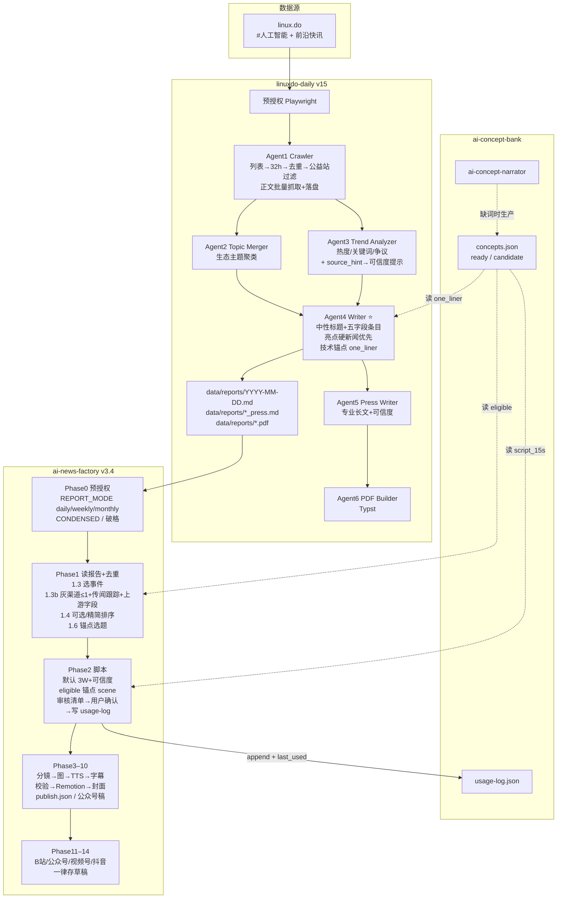

### 1.1 主链路时序（人在环）

```text
T0  用户触发「日报」→ linuxdo 预授权 → 抓取/合并/趋势
T1  Writer 出 MD（你可改）→ Press + PDF
T2  用户触发「新闻工厂/日报视频」→ factory 预授权
T3  Phase1：展示去重 / 灰渠道裁剪 / 事件列表 / 锚点 top3 → 你确认
T4  Phase2：生成 3W 脚本 + 锚点 scene → 审核清单 → 你确认文案
T5  写 usage-log + 更新 concepts last_used（子模块变脏，不自动 commit）
T6  Phase3–10 出片（可并行封面）
T7  Phase11–14 各平台存草稿 → 你手动发布
```

---

## 2. 产线 B：linuxdo-daily 详细流程

### 2.1 Agent 流水线

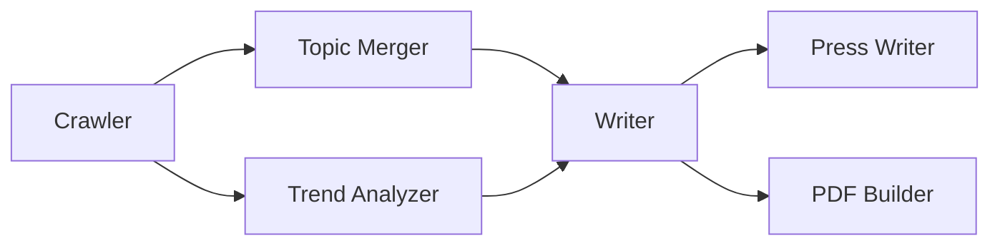

| Agent | 输入 | 输出 | v15 相对旧版增量 |
|-------|------|------|------------------|
| Crawler | 双源页面 | `data/daily/{date}.json` 等 | 过滤词扩展（交易帖）；主流程不变 |
| Merger | posts | 主题分组 | 不变 |
| Trend | posts | 趋势摘要 | **`source_hint` → 五档提示** |
| **Writer** | 分组+趋势+(概念库) | **主报告 MD** | **五字段条目、亮点格式、one_liner、概念候选** |
| Press | 主报告 | `*_press.md` | 可信度 + one_liner |
| PDF | 主报告 | typ/pdf | 不变 |

### 2.2 Writer 单帖条目（报告侧专业原料）

```text
- **{中性重写标题}** — {事实摘要 1–2 句}
  - 可信度：{五档之一}          ← 必填
  - 影响：{对用户/开发者/行业}   ← 必填
  - 技术锚点：{name} — {one_liner}  ← 有 ready 命中时写；禁止贴 script_15s
  - 信号：浏览 X · 争议度高/中/低
```

亮点：

```text
1. [{可信度}] {一句话事实} — 影响：{一句}（浏览 X）
   约束：权益/封号类不得占亮点 >50%
```

可选文末：

```text
## 概念候选（供 concept-bank）
- {新黑话} — 出现在：{帖标题}
```

### 2.3 过滤与降权（评估灰产标签时看这里）

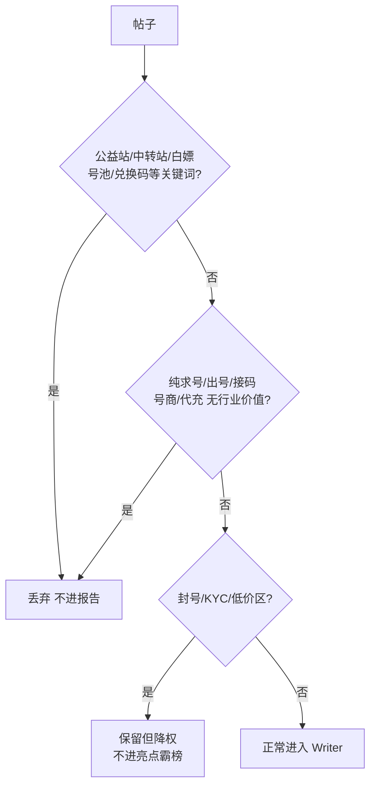

### 2.4 周报 / 月报变体

| 模式 | 数据 | Writer 重点 |
|------|------|-------------|
| 日报 | 实时抓取 + 32h + 历史去重 | 单帖五字段 |
| 周报 | 聚合当周 daily/reports | 亮点+大事记带可信度；趋势写受益/承压/观察 |
| 月报 | 聚合当月，不重抓 | 4 趋势 + 可信度区间；TOP 禁套利帖 |

---

## 3. 产线 C：ai-news-factory 详细流程

### 3.1 Phase 总图（0→14）

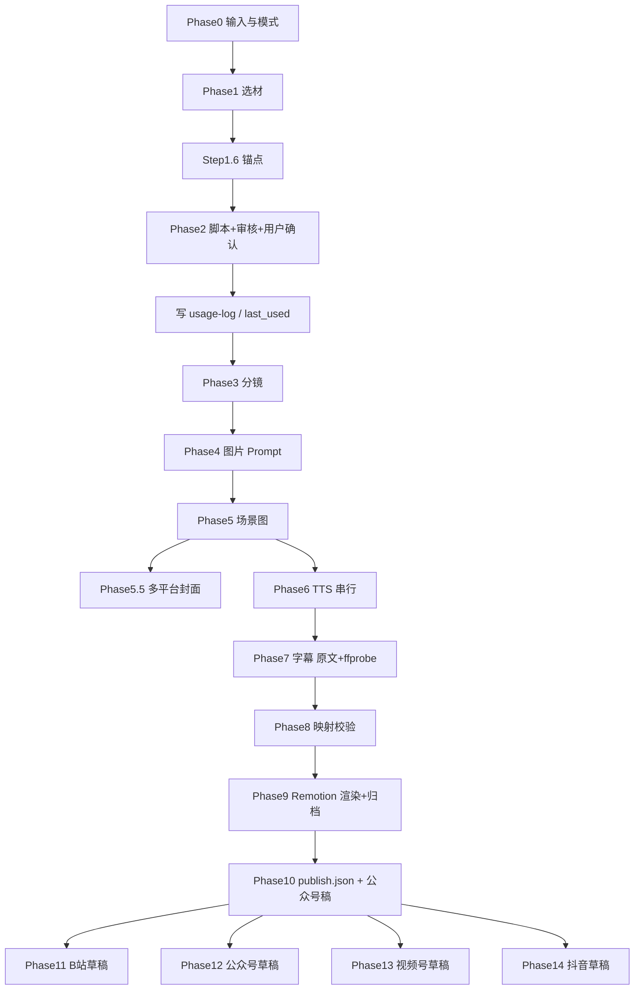

### 3.2 Phase 1 选材放大（专业度关键闸门）

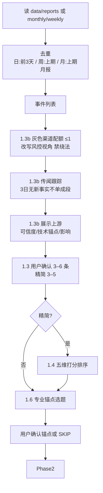

**Step 1.6 锚点打分（摘要）**

| 分 | 条件 |
|----|------|
| +100 | keywords 命中本期事件 |
| +40 | tier==1 |
| +20 | 从未 last_used |
| +10 | 越久未用 |
| +5 | use_count 低 |
| 冷却 | 同角度 &lt; reuse_gap_days(14) 不默认推荐 |

输出会话变量：`ANCHOR_CONCEPT_ID` / `ANGLE` / `DURATION_SEC` / `SKIP`。

### 3.3 Phase 2 脚本结构（默认 3W）

```text
标题：{事件+影响，禁情绪词}
Hook：{5s 钩子 → 下一句事实}

[每条新闻]
  What：可验证事实
  So What：影响
  Now What：跟进建议
  可信度：五档之一

[场景 专业锚点]  ← 独立 TTS+图
  {eligible.script_15s 或 script_60s}
  仅允许 ≤15 字过渡前缀

CTA
```

**模板文件**

| 文件 | 作用 |
|------|------|
| `templates/script-template.md` | 日/周默认 3W + 示例 |
| `templates/script-template-monthly.md` | 趋势 3W + 锚点 scene |
| `templates/credibility-and-tone.md` | 五档、黑名单、灰渠道、标题示例 |
| `templates/professional-anchor.md` | 1.6 算法、eligible、log 字段 |

### 3.4 用户确认后写 log（闭环）

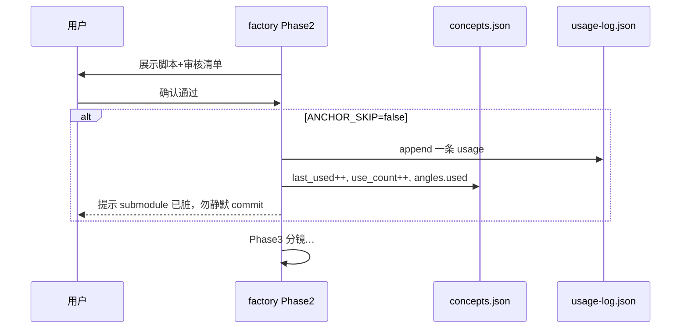

### 3.5 渲染与上传（未改业务，仅场景数+1）

- 锚点 = **多 1 个 scene** → 多 1 图 + 1 wav；Phase8：`images == audios == scenes`  
- 上传一律**存草稿**（B站/抖音/视频号/公众号）

---

## 4. 产线 A：ai-concept-bank 生命周期

### 4.1 概念状态机

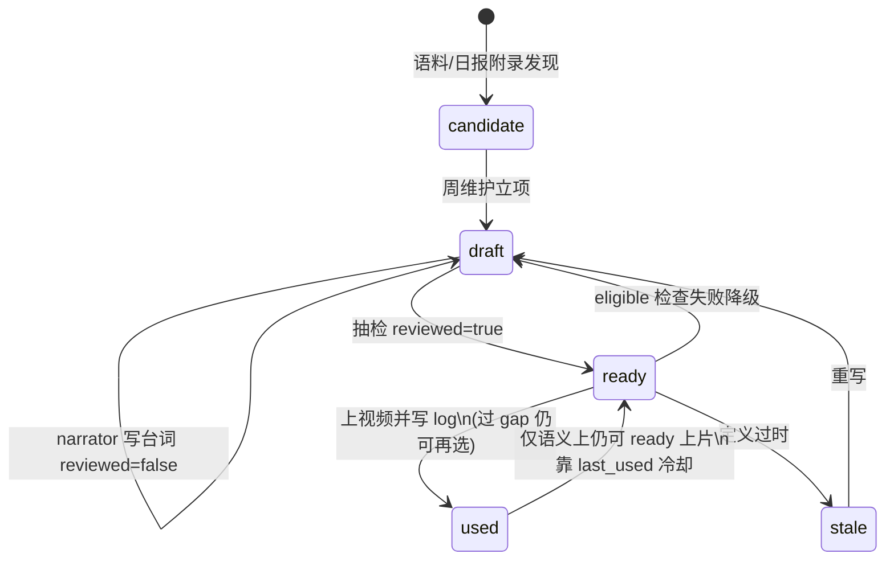

### 4.2 台词生产（唯一入口）

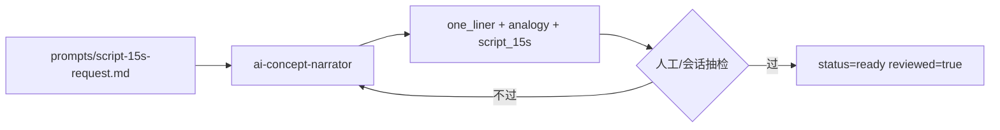

**禁止路径（评估时重点查是否被绕过）**

```text
❌ social_media 白说库 → 直接 script_15s
❌ Gemini/GPT 方案草稿 → 直接 ready
❌ factory 主会话即兴长段专业解释当成品
❌ Writer 把 script_15s 贴进日报
```

### 4.3 目录与读写矩阵

```text
ai-concept-bank/
├── concepts.json          # 主库
├── usage-log.json         # 上片记录
├── extracts/              # term-frequency 语料反提
├── agents/ai-concept-narrator.md
├── prompts/script-15s-request.md
├── README.md              # SOP
└── _archive/              # 历史方案
```

| 文件 | Writer | factory 1.6/2 | narrator | 人/月维护 |
|------|:------:|:-------------:|:--------:|:---------:|
| concepts.json | 读 one_liner | 读 eligible / 写 last_used | 写台词 | 晋升/stale |
| usage-log.json | — | **写** | — | 复盘 |
| extracts/* | — | — | 可参考 | **重跑** |
| narrator agent | — | 缺词时调 | 自身 | 改 prompt |

---

## 5. 数据契约：报告字段 → 视频字段

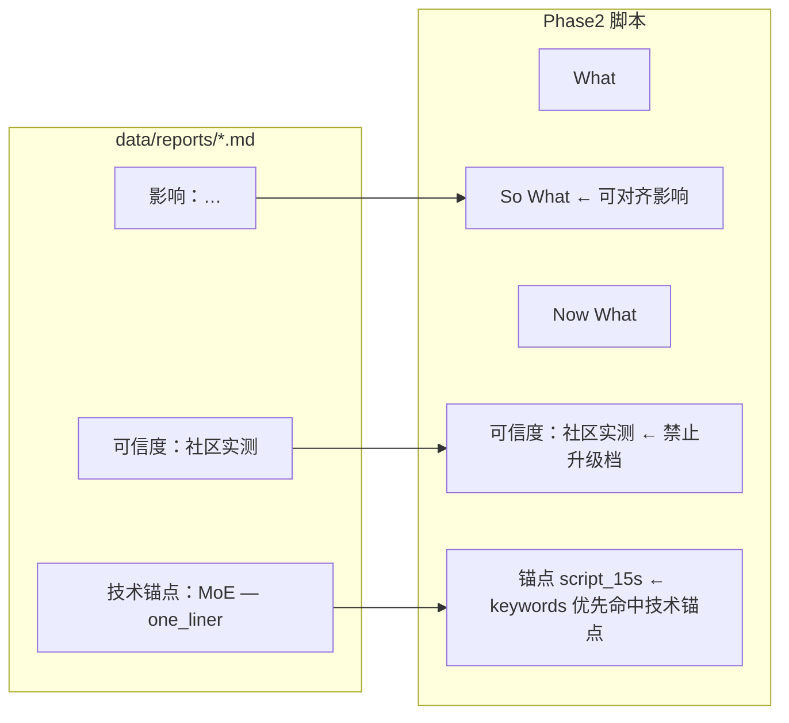

**未确认传闻**两端语气必须一致：报告写「未确认」→ 视频不得说「已经发布」。

---

## 6. 模式矩阵（daily / weekly / monthly / 精简 / 破格）

| 维度 | daily | weekly | monthly | 精简叠加 | 破格叠加 |
|------|-------|--------|---------|----------|----------|
| 输入 | 单日 MD | 7 日聚合 | monthly MD | 条数↓ | 标记破格 |
| 结构 | 3W+可信度 | 3W+可信度 | 趋势内嵌 3W | 同结构更短 | 不可盖可信度/黑名单 |
| 锚点 | 15s×1 | 30–60s×1 | 30–60s×1 | 仍 1 个 | 仍 1 个 |
| 灰渠道 | ≤1 | ≤1 | ≤1 | ≤1 | ≤1 |
| 建议时长 | 75–135s≤160 | 100–150s | 200–280s≤320 | 60–100s | 视内容 |

---

## 7. 维护图（日 / 周 / 月 / 季度）

### 7.1 总维护雷达

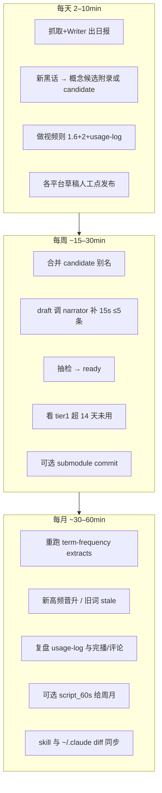

### 7.2 角色 × 维护职责

| 维护动作 | 你 | Claude 主会话 | narrator | 自动化 |
|----------|:--:|:-------------:|:--------:|:------:|
| 抓取日报 | 授权 | 执行 skill | — | — |
| 标可信度/中性标题 | 抽检 | Writer 生成 | — | — |
| 写 15s 台词 | 审核 | 调 agent | **写** | — |
| 选视频事件/锚点 | **确认** | 1.3/1.6 提案 | — | — |
| usage-log | 知晓 submodule | **写** | — | — |
| term-frequency | 触发 | 跑脚本 | — | 可脚本化 |
| 平台发布 | **手动** | 存草稿 | — | — |
| skill 双向同步 | 要求 | cp | — | — |

### 7.3 概念库维护细图

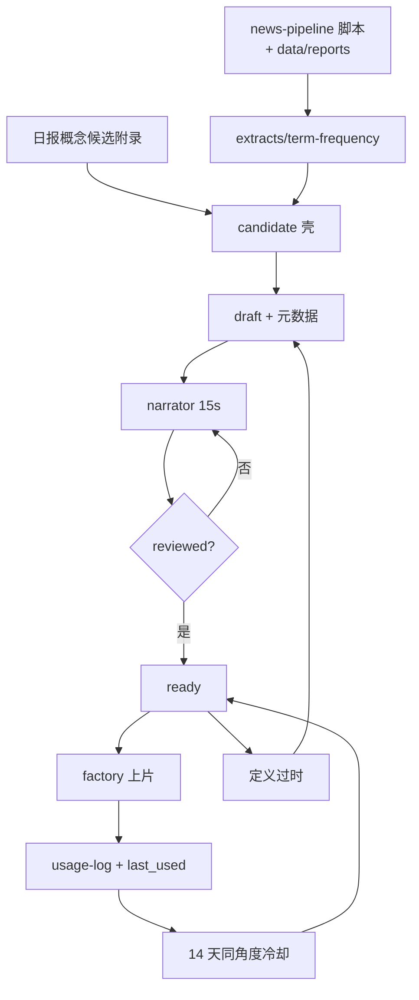

### 7.4 skill / 子模块版本维护

```text
改 linuxdo-daily 或 ai-news-factory
  → 改 skills/<name>/
  → cp 到 ~/.claude/skills/<name>/
  → diff 确认一致

改 ai-concept-bank
  → 在 submodule 内 commit + push
  → 父仓 bump 指针 + push

factory 写了 usage-log 但未 commit
  → 子模块 working tree dirty（预期）
  → 批量维护日再 commit，避免每期打断
```

---

## 8. 文件级地图（评估「改一处会牵动谁」）

```text
learn-claude-code/
├── ai-concept-bank/                 # submodule
│   ├── concepts.json
│   ├── usage-log.json
│   ├── extracts/
│   ├── agents/ai-concept-narrator.md
│   └── prompts/script-15s-request.md
├── data/
│   ├── reports/*.md                 # Writer 主输出 → factory 输入
│   ├── daily/*.json
│   ├── weekly/  monthly/
├── news-pipeline/
│   ├── YYYY-MM-DD/                  # 单期视频工程产物
│   │   scripts/ images/ voiceover/ …
│   └── video-project/               # Remotion
├── skills/
│   ├── linuxdo-daily/SKILL.md       # v15
│   └── ai-news-factory/
│       ├── SKILL.md                 # v3.4
│       └── templates/
│           professional-anchor.md
│           credibility-and-tone.md
│           script-template.md
│           script-template-monthly.md
│           …
├── social_media/                    # 分析与本评估文档（非运行时主库）
└── ~/.claude/skills/…               # 运行时镜像，必须与 skills/ 同步
```

**运行时只认**

- 概念：`ai-concept-bank/concepts.json`  
- **不认**：`news-pipeline/concept-bank/`、`social_media/*白说库*` 作为 ready 源  

---

## 9. 与改造前对比（评估收益/成本）

| 环节 | 改造前 | 改造后（目标态） |
|------|--------|------------------|
| 报告条目 | 标题+浅摘要+浏览 | 可信度+影响+技术锚点+信号 |
| 亮点 | 偏浏览量/情绪 | 硬新闻优先+可信度标签 |
| 视频结构 | Hook+叙述+情绪词 | **默认 3W+可信度** |
| 专业深度 | &lt;2%、临场发挥 | 每期 1 eligible 锚点 |
| 灰产观感 | 封号/低价高占比 | 配额≤1 + 风控表述 |
| 概念台词 | 无库存/不一致 | narrator 统一产线 |
| 防重复 | 无 | last_used + 14 天 gap + usage-log |
| 成本 | 短 | Writer 变长；Phase1 多确认步；子模块偶发脏 |

---

## 10. 评估清单（建议你按表打分）

### 10.1 闭环完整性

| # | 问题 | 期望 | 你的结论 |
|---|------|------|----------|
| 1 | 无 concept-bank 时 factory 能否降级跳过锚点？ | 能提示并 SKIP | |
| 2 | 非 narrator 的 ready 会否被 1.6 选中？ | 否（eligible） | |
| 3 | 用户确认脚本后是否**每次**写 log？ | 是（非 SKIP） | |
| 4 | Writer 是否可能漏标可信度？ | 条文必填；执行靠模型遵守 | 🟡 |
| 5 | 上游未确认 → 下游是否仍说「已发布」？ | 禁止；靠审核清单 | 🟡 |
| 6 | 灰渠道第 2 条会否仍进脚本？ | 1.3b 应裁 | 🟡 |
| 7 | skills/ 与 ~/.claude 是否长期一致？ | 每次改完 cp | 需纪律 |
| 8 | usage-log 是否拖垮 git 体验？ | 脏 submodule 可接受 | 流程题 |

### 10.2 体验与产能

| # | 问题 | 备注 |
|---|------|------|
| 1 | Phase1 确认步是否过多（去重+事件+锚点）？ | 可合并 UI 但仍需人在环 |
| 2 | 15s 锚点是否打断节奏？ | 独立 scene；可评估完播掉点 |
| 3 | Writer 五字段是否导致日报过长？ | 低价值帖可短写 |
| 4 | 20 ready 是否覆盖日常命中？ | 月维护 term-frequency |

### 10.3 尚未自动化 / 仍靠约定

```text
🟡 可信度标注质量（无分类器，靠 Writer 模型）
🟡 灰渠道关键词召回（规则表，非 ML）
🟡 term-frequency 重跑（有 SOP，无强制 cron）
🟡 script_60s 大多为空（周月 15s 兜底）
🟡 完播/评论回流 usage-log（字段有，采集无）
✅ Remotion/上传链路未为专业度重写（仅 +1 scene）
```

---

## 11. 推荐评估路径（半小时）

1. **静态读**本文件 §0–§3 + `credibility-and-tone.md` + `professional-anchor.md`  
2. **打开**最近一天 `data/reports/*.md`：是否已有五字段？（旧报告可能没有 → factory 现场补判）  
3. **干跑** factory Phase1+2（不渲染）：看 3W、灰渠道、锚点候选、确认后 concepts/usage-log 是否变  
4. **抽 1 条** ready：`authored_by` / `reviewed` / 违禁词  
5. **diff** `skills/*` vs `~/.claude/skills/*`  
6. 记录：哪些是条文缺口 vs 执行缺口 vs 产品体验问题  

---

## 12. 相关文档索引

| 文档 | 路径 |
|------|------|
| 双链路 plan | `~/.claude/plans/social-media-md-social-media-gemini-md-woolly-liskov.md` |
| 概念库 SOP | `ai-concept-bank/README.md` |
| factory skill | `skills/ai-news-factory/SKILL.md` |
| daily skill | `skills/linuxdo-daily/SKILL.md` |
| 历史分析 | `social_media/gpt分析-全量脚本内容分析报告.md` 等 |
| 本评估图 | `social_media/改造后完整流程图与维护图.md`（本文件） |

---

## 13. 一句话结论（便于你评估开场）

**改造后的系统 =「报告侧强制可信度与中性表达」+「视频侧默认 3W 与灰渠道配额」+「概念侧唯一 narrator 台词库与 usage-log 冷却」；三条线用 `concepts.json` / 报告字段 / usage-log 咬合，上传与渲染主干未重做。**  

评估重点不要放在 Phase11–14，而应放在：**Writer 是否真写五字段、1.6 是否只选 eligible、确认后是否写 log、两端可信度语气是否一致。**
